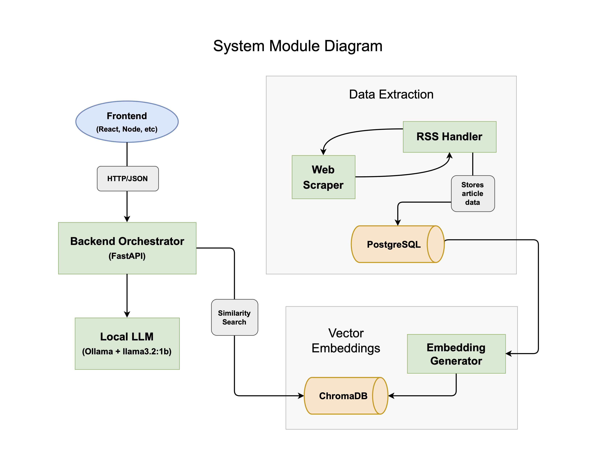
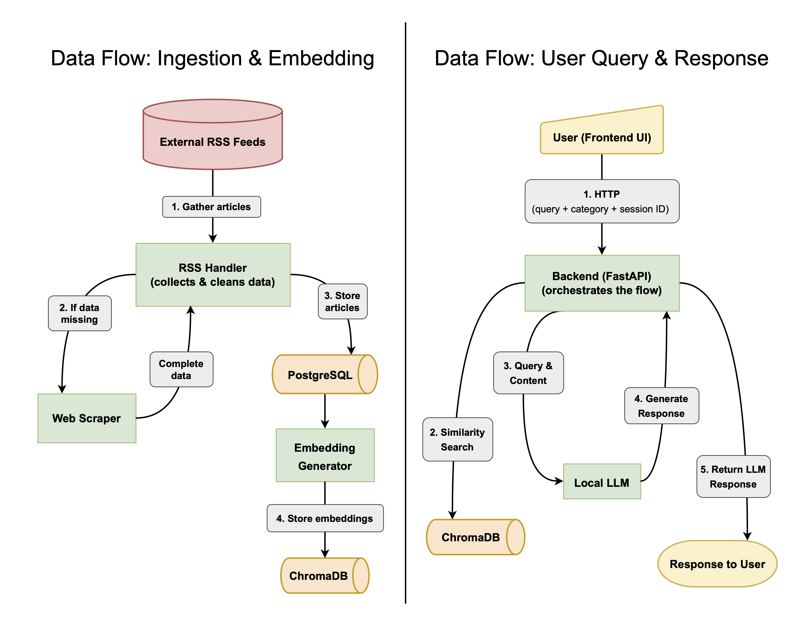
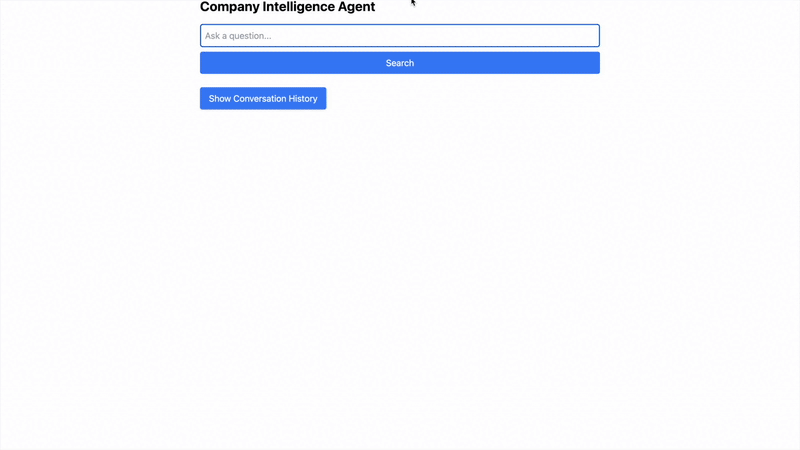
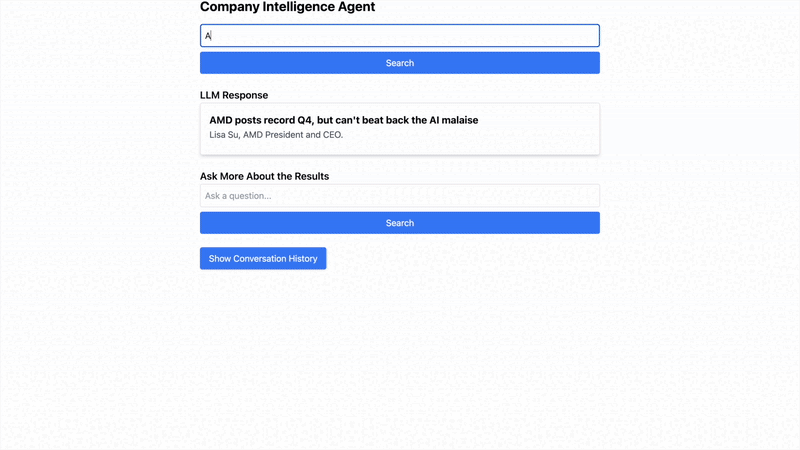

# company-intelligence-agent

An AI-powered intelligence agent that monitors and analyzes company-related news, categorizes content into meaningful groups, and enables users to query information through a simple interface.

## Overview

The **Company Intelligence Agent** is designed to monitor and analyze company-related news and content. Data is collected and processed from online sources (RSS feeds, web scraping, etc.). A Retrieval-Augmented Generation (RAG) system then integrates this data into a local Large Language Model (LLM), allowing users to query the information through a locally hosted interface.

### Features

- **Automated Content Collection**  
  Collects data from configurable RSS feeds and web sources (blogs, websites, etc.).

- **Intelligent Categorization**  
  Leverages an LLM to classify or cluster collected content into meaningful categories.

- **Search & Query Support**  
  Offers a user-friendly interface, enabling you to browse or query collected data directly.

## System Overview

### System Module Design



### Data Flow



## Repository Structure

```
company-intelligence-agent/
|
├── scripts/                 # Routine scripts for initial set-up
│   ├── postgres_init.py     # Sets up the postgreSQL user, database, and table locally
│   ├── chroma_init.py       # Sets up the ChromaDB database locally
│   ├── embedding_model.py   # Populates the ChromaDB database with vector embeddings
|
│── src/                     # Main source code
│   │── backend/             # Backend code (Data pipeline, LLM integration)
│   │── frontend/            # Frontend code (React, Node.js)
│   │── orchestrator/        # Manages content ingestion (FastAPI) and updates
│   │── utils/               # Helper functions and additional utilities
│
│── configs/                 # Config files (e.g., env variables, settings)
│── tests/                   # Unit and integration tests
│── docs/                    # Documentation (API specs, setup guide)
│── .gitignore               # Ignore unnecessary files
│── README.md                # Project overview and instructions
│── requirements.txt         # Python dependencies
│── LICENSE                  # License file
```

## Setup Instructions

### Prerequisites

- **Python 3.10+**
- **Node.js** (for the frontend; version 16+ recommended)
- **Tailwind CSS** (installed alongside the frontend)
- **FastAPI** (installed via `requirements.txt`)
- **Ollama** (for local LLM inference)
- **PostgreSQL** (for storing extracted data in a local database)

### Installation

1. Clone the repository:
   ```bash
   git clone https://github.com/p-breslin/company-intelligence-agent.git
   cd company-intelligence-agent
   ```
2. Set up a virtual environment and install Python dependencies:
   ```bash
   python -m venv venv
   source venv/bin/activate   # On Windows use: venv\Scripts\activate
   pip install -r requirements.txt
   ```
3. Install frontend dependencies:
   ```bash
   cd src/frontend
   npm install
   cd ../..
   ```
4. Initialize and populate the the postgreSQL database:
   ```bash
   python scripts/postgres_init.py
   python src/backend/async_extract_data.py
   ```
5. Initialize and populate the the ChromaDB database:
   ```bash
   python scripts/chroma_init.py
   python scripts/embedding_model.py
   ```

## Usage

1. **Run the run file from the project root:** `./run.sh`

- This launches a FastAPI server (main.py in src/orchestrator) that handles data ingestion, categorization, and LLM queries.
- It also navigates to src/frontend and runs the web interface via `npm run dev`
- Access the web interface at http://localhost:5173 (or whichever port is configured).

2. **Interact with the Application**

- The system will automatically collect and process the user input.
- Use the web interface to run queries and browse conversation history.

**Initial Query:**



**Follow-Up Query & Viewing Conversation History:**



**New Query**


## Troubleshooting

- **Database Issues:** Verify your PostgreSQL or Chroma instance is running and configured properly in any relevant scripts or environment variables.
- **Missing Dependencies:** Double-check you installed everything in requirements.txt (for Python) and package.json (for Node).
- **CORS or Network Errors:** If requests are blocked, adjust the FastAPI or React dev server settings to allow cross-origin requests.
- **Ollama Errors:** Ensure Ollama is installed and running if you rely on local LLM inference.

## License

TO-DO
