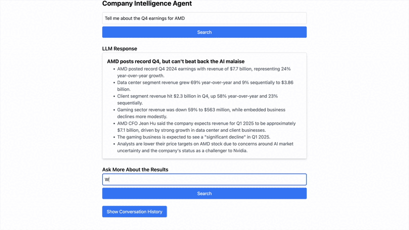

# company-intelligence-agent

An AI-powered intelligence agent that monitors and analyzes company-related news, categorizes content into meaningful groups, and enables users to query information through a simple interface.

## Overview

The **Company Intelligence Agent** is designed to monitor and analyze company-related news and content. Data is collected and processed from online sources (RSS feeds, web scraping, etc.). A Retrieval-Augmented Generation (RAG) system then integrates this data into a local Large Language Model (LLM), allowing users to query the information through a locally hosted interface.

### Features

- **Automated Content Collection**  
  Collects data from web sources (blogs, websites, etc.).

- **Intelligent Categorization**  
  Leverages an LLM to classify or cluster collected content into meaningful categories.

- **Search & Query Support**  
  Offers a user-friendly interface, enabling you to browse or query collected data directly.

## System Overview

### System Module Design


### Data Flow


## Repository Structure

```
company-intelligence-agent/
|
├── scripts/                 # Routine scripts for initial setup
│   ├── arango/              # ArangoDB setup scripts for local graph storage
│   ├── chroma/              # ChromaDB setup scripts for local vector storage
│   ├── postgres/            # PostgreSQL setup scripts for local SQL storage
│   ├── weaviate/            # Weaviate setup scripts for local vector storage
│   ├── database_init.py     # Orchestrates setup for databases used
|
│── src/                     # Main source code
│   │── app/                 # Core application logic
│   │── web/                 # Web application code (React, Node.js)
│   │── orchestrator/        # Manages API calls between frontend and backend
│   │── utils/               # Helper functions and additional utilities
│
│── configs/                 # Configuration files
│── tests/                   # Unit and integration tests
│── docs/                    # Documentation (API specs, setup guide)
│── .gitignore               # Ignore unnecessary files
│── README.md                # Project overview and instructions
│── requirements.txt         # Python dependencies
│── LICENSE                  # License file
```

## Setup Instructions

### Prerequisites

- **Python 3.10+**
- **React**
- **Node.js**
- **Tailwind CSS**
- **FastAPI** (installed via `requirements.txt`)
- **ChromaDB** (installed via `requirements.txt`)
- **Ollama** (for local LLM inference)
- **PostgreSQL**

### Installation

1. Clone the repository:
   ```bash
   git clone https://github.com/p-breslin/company-intelligence-agent.git
   cd company-intelligence-agent
   ```
2. Set up a virtual environment and install Python dependencies:
   ```bash
   python -m venv venv
   source venv/bin/activate   # On Windows use: venv\Scripts\activate
   pip install -r requirements.txt
   ```
3. Install the project as a package:
   ```bash
   pip install -e .
   ```
4. Install UI dependencies:
   ```bash
   cd src/web
   npm install
   cd ../..
   ```
5. Set up and initialize the databases:
   ```bash
   python scripts/database_init.py
   ```
6. Choose a data extraction method:
   ```bash
   cd src/app/data_extraction/
   ```
7. Good to go!

## Usage

1. **Run the run file from the project root:** `./run.sh`

- This launches a FastAPI server (main.py in src/app/orchestrator) that handles data ingestion, categorization, and LLM queries.
- It also navigates to src/frontend and runs the web interface via `npm run dev`
- Access the web interface at http://localhost:5173 (or whichever port is configured).

2. **Interact with the Application**

- The system will automatically collect and process the user input.
- Use the web interface to run queries and browse conversation history.

**Initial Query:**


**Follow-Up Query & Viewing Conversation History:**



**New Query**


## Troubleshooting

- **Database Issues:** Verify your PostgreSQL or Chroma or Weaviate instance is running and configured properly in any relevant scripts or environment variables.
- **Missing Dependencies:** Double-check you installed everything in requirements.txt (for Python) and package.json (for Node).
- **CORS or Network Errors:** If requests are blocked, adjust the FastAPI or React dev server settings to allow cross-origin requests.
- **Ollama Errors:** Ensure Ollama is installed and running if you rely on local LLM inference.

## License

TO-DO
