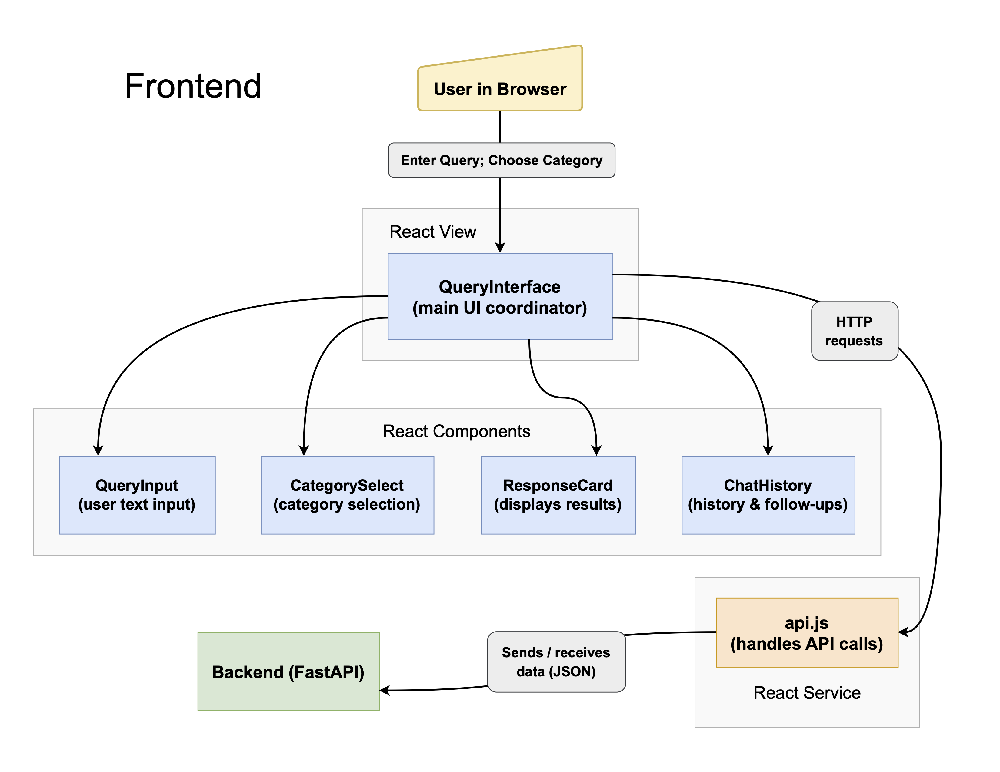

# Frontend - Company Intelligence Agent

This directory contains the frontend code for the Company Intelligence Agent, built using React and Vite. The frontend provides an intuitive user interface for querying and browsing categorized company-related content.

## Overview



## Structure

```
frontend/
│── public/                         # Static assets
│── src/                            # Source code
│   │── assets/                     # Static files (images, icons, etc.)
│   │── components/                 # Reusable UI components
│   │   ├── CategorySelection.jsx   # Functionality for selecting content categories
│   │   ├── ChatHistory.jsx         # Displays previous user queries and responses
│   │   ├── QueryInput.jsx          # User input field for search queries
│   │   ├── ResponseCard.jsx        # Displays LLM responses from the backend
|   |
│   │── services/                   # API interaction logic
│   │   ├── api.js                  # Handles API requests to the backend
|   |
│   │── state/                      # State management
│   │── utils/                      # Utility functions
│   │── views/                      # Page views for different parts of the application
│   │   ├── QueryInterface.jsx      # Main UI component integrating all frontend elements
|   |
│   │── App.jsx                     # Root component of the application
│   │── App.css                     # Global styles
│   │── index.css                   # CSS resets and theme styles
│   │── main.jsx                    # Entry point for the React application
|
│── package.json                    # Dependencies and project metadata
│── vite.config.js                  # Vite configuration file
│── tailwind.config.js              # Tailwind CSS configuration
│── eslint.config.js                # ESLint configuration
│── README.md                       # This documentation file
```

## Key Components

### 1. **Main User Interface (`views/QueryInterface.jsx`)**

- The central page where users interact with the system.
- Displays the search bar, query results, and chat history.
- Uses components from `components/` to build the interface.

### 2. **Reusable Components (`components/`)**

- `CategorySelection.jsx`: Allows users to filter queries by category.
- `ChatHistory.jsx`: Displays past queries and responses.
- `QueryInput.jsx`: Handles user input for search queries.
- `ResponseCard.jsx`: Displays the response received from the backend.

### 3. **API Communication (`services/api.js`)**

- Manages API calls to the backend.
- Fetches categorized content and query results.

### 4. **Styling**

- `App.css`: Contains global styles.
- `index.css`: Includes theme and resets.
- Uses **Tailwind CSS** for styling (configured in `tailwind.config.js`).
